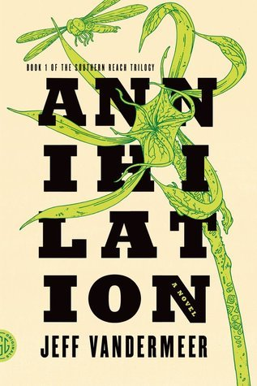

# Sci-Fi Month

## Annihilation (2014)
### Jeff VanderMeer

**Description:**  
Area X has been cut off from the rest of the world for decades. Nature has reclaimed the last vestiges of human civilization. The first expedition returned with reports of a pristine, Edenic landscape; the second expedition ended in mass suicide, the third in a hail of gunfire as its members turned on one another. The members of the eleventh expedition returned as shadows of their former selves, and within weeks, all had died of cancer. In Annihilation, the first volume of Jeff VanderMeer's Southern Reach Trilogy, we join the twelfth expedition.

The group is made up of four women: an anthropologist; a surveyor; a psychologist, the de facto leader; and our narrator, a biologist. Their mission is to map the terrain, record all observations of their surroundings and of one another, and, above all, avoid being contaminated by Area X itself.

They arrive expecting the unexpected, and Area X delivers—but it’s the surprises that came across the border with them and the secrets the expedition members are keeping from one another that change everything.

**Word Count:** ~55,000 words

**Audiobook Length:** 6 hours

**Goodreads Rating:**

(3.77)

---

## All Systems Red (2017)
### Martha Wells

**Description:**  
"As a heartless killing machine, I was a complete failure."

In a corporate-dominated space-faring future, planetary missions must be approved and supplied by the Company. For their own safety, exploratory teams are accompanied by Company-supplied security androids. But in a society where contracts are awarded to the lowest bidder, safety isn’t a primary concern.

On a distant planet, a team of scientists is conducting surface tests, shadowed by their Company-supplied ‘droid--a self-aware SecUnit that has hacked its own governor module and refers to itself (though never out loud) as “Murderbot.” Scornful of humans, Murderbot wants is to be left alone long enough to figure out who it is, but when a neighboring mission goes dark, it's up to the scientists and Murderbot to get to the truth.

**Word Count:** 31,468 words

**Audiobook Length:** 3 hours 17 minutes

**Goodreads Rating:**

(4.15)

---

## Ender's Game (1985)
### Orson Scott Card

**Description:**  
Andrew "Ender" Wiggin thinks he is playing computer simulated war games; he is, in fact, engaged in something far more desperate. The result of genetic experimentation, Ender may be the military genius Earth desperately needs in a war against an alien enemy seeking to destroy all human life. The only way to find out is to throw Ender into ever harsher training, to chip away and find the diamond inside, or destroy him utterly. Ender Wiggin is six years old when it begins. He will grow up fast.

But Ender is not the only result of the experiment. The war with the Buggers has been raging for a hundred years, and the quest for the perfect general has been underway almost as long. Ender's two older siblings, Peter and Valentine, are every bit as unusual as he is, but in very different ways. While Peter was too uncontrollably violent, Valentine very nearly lacks the capability for violence altogether. Neither was found suitable for the military's purpose. But they are driven by their jealousy of Ender, and by their inbred drive for power. Peter seeks to control the political process, to become a ruler. Valentine's abilities turn more toward the subtle control of the beliefs of commoner and elite alike, through powerfully convincing essays. Hiding their youth and identities behind the anonymity of the computer networks, these two begin working together to shape the destiny of Earth-an Earth that has no future at all if their brother Ender fails.

**Word Count:** 100,758 words

**Audiobook Length:** 7 hours 24 minutes

**Goodreads Rating:**

(4.31)

---